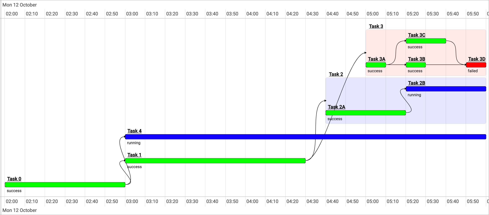

# Graphical Rollouts UI


TDG (i.e. timeline-dep-graph) is a visualization library to represent rollouts graphically. The tasks are represented as a rectangular bar on the timeline and spanning the time it elapsed to execute. The library supports visualizing subtasks within a parent task (i.e. rollout hierarchy) by encapsulating the subtasks within the parent task and visualizes the dependencies between tasks using directed arrows.
The library dynamically detects the changes in the provided tasks array and according repaints only the affected tasks and/or dependencies (i.e. add/remove/update). 

There is a set of supported features such as zooming in/out, navigating to the beginning/end of the rollout, grouping tasks based on status, fit the visible screen to include the whole rollout and focusing on a task by giving its id.

## Build
To build the library from source, clone the project from github
```
$ git clone https://github.com/SarAhmed/timeline-dep-graph.git
```
Then To install all dependencies and build the library, run `npm install` in the root of the project.
```
$ cd timeline-dep-graph/
$ npm install
```
Then run 
```
$ npm run build
```
OR, run `ng build` in the angular project directory to build the project. The build artifacts will be stored in the `dist/` directory. Use the `--prod` flag for a production build.
```
$ cd timeline-dep-graph/
$ ng build
```

## Development server
Run `ng serve` in the angular project for a dev server. Navigate to `http://localhost:4200/`. The app will automatically reload if you change any of the source files.

Install the project dependecies <em>once</em>
```
$ cd timeline-dep-graph/
$ npm install
```
Then run
```
$ cd timeline-dep-graph/
$ ng serve
```

## Running unit tests
Run `ng test` to execute the unit tests via [Karma](https://karma-runner.github.io).

Install the project dependecies <em>once</em>
```
$ cd timeline-dep-graph/
$ npm install
```
Then run
```
$ cd timeline-dep-graph/
$ ng test
```

## API
``` js
export type TaskId = string;

/**
 * Status represents the statuses that a task can have.
 * The statuses are ordered by priority. For example in the provided
 * statuses below, FAILED has the highest priority and SUCCESS
 * has the lowest priority.
 * Thus if tasks are grouped, FAILED tasks will be in the most upper group level
 * and SUCCESS tasks will be in the lowest group level.
 *
 * If more Statuses are needed, please add them below and add their
 * associated styling in the `styles.scss` or in your global styling file.
 * For every new status add two classes:
 *
 * rect.tdg-(status value) {
 *  fill: (status color);
 * }
 *
 * small.tdg-(status value) {
 *  color: (status color);
 * }
 *
 * For example, adding an `ACTION_REQUIRED = action_required` status.
 * Their styling could be:
 * ```
 * rect.tdg-action_required {
 *  fill: orange;
 * }
 *
 * small.tdg-action_required {
 *  color: orange;
 * }
 */
enum Status {
  UNKNOWN,
  SUCCESS,
  RUNNING,
  FAILED,
  BLOCKED,
}

interface Task {
  readonly id: TaskId;
  name: string;
  status: Status;
  dependants: TaskId[];
  startTime?: Date;
  finishTime?: Date;
  subTasks: Task[];
}

@Component{...}
class DependencyGraph {
   @Input() tasks: Task[] = [];

  /**
   * The minHeight of the timeline is in pixels or as a percentage.
   * ```
   * minHeight = 400; // Sets the timeline's minimum height to 400px.
   * minHeight = "400px"; // Sets the timeline's minimum height to 400px.
   * minHeight = "50%"; // Timeline spans in minimum 50% of its parent's height.
   * ```
   */
  @Input() minHeight?: number | string;

  /**
   * The width of the timeline is in pixels or as a percentage.
   * When width is undefined or null,
   * the width of the timeline spans 100% of its parent's width.
   * ```
   * width = 400; // Sets the timeline's width to 400px.
   * width = "400px"; // Sets the timeline's width to 400px.
   * width = "50%"; // Timeline spans 50% of its parent's width.
   * ```
   */
  @Input() width?: number | string;

  /**
   * Adjust the visible window such that,
   * the selected task is centered on the screen.
   */
  @Input() focusTask?: TaskId;

  /**
   * selectedTask is fired when the task name is being clicked on.
   */
  @Output() selectedTask = new EventEmitter<TaskId>();

  /**
   * taskOver is fired when the cursor moves over a task.
   */
  @Output() taskOver = new EventEmitter<TaskId>();

  /**
   * taskOut is fired when the cursor moves out of a task.
   */
  @Output() taskOut = new EventEmitter<TaskId>();
}

```

## Contribute
Contributions to the TDG library are very welcome. Please check [this](CONTRIBUTING.md).

## License
Apache 2.0

This is not an official Google product.
